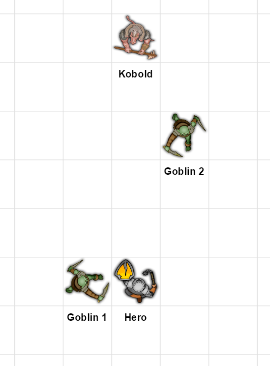
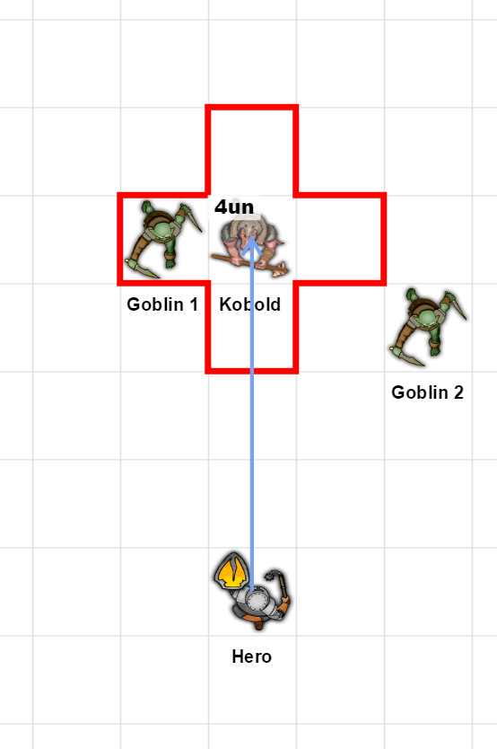
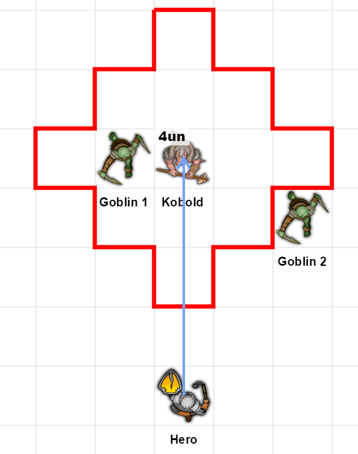

Stardust RPG
============

.. image:: https://travis-ci.org/johnthagen/stardust-rpg.svg
    :target: https://travis-ci.org/johnthagen/stardust-rpg

.. image:: https://codeclimate.com/github/johnthagen/stardust-rpg/badges/gpa.svg
   :target: https://codeclimate.com/github/johnthagen/stardust-rpg

.. image:: https://codeclimate.com/github/johnthagen/stardust-rpg/badges/issue_count.svg
   :target: https://codeclimate.com/github/johnthagen/stardust-rpg

.. image:: https://codecov.io/github/johnthagen/stardust-rpg/coverage.svg
    :target: https://codecov.io/github/johnthagen/stardust-rpg

.. image:: https://img.shields.io/pypi/v/stardust-rpg.svg
    :target: https://pypi.python.org/pypi/stardust-rpg

.. image:: https://img.shields.io/pypi/status/stardust-rpg.svg
    :target: https://pypi.python.org/pypi/stardust-rpg

.. image:: https://img.shields.io/pypi/pyversions/stardust-rpg.svg
    :target: https://pypi.python.org/pypi/stardust-rpg/

Stardust RPG is a tactical d20 role-playing game designed to provide a variety of progression
options for players and encourage teamwork.  Baseline content is based off the Stardust book
series by John Hagen but is adaptable to a variety of fantasy settings.

Features
--------

- Cross platform.  Run the server on any platform that supports Python.  Clients can
  connect and manage their characters using a standard web browser with no install required.
- `Roll20 <https://roll20.net/>`_ integration. Players can to automatically sync their character
  stats and automatically generated weapon and ability macros right into a Roll20 campaign.
  Special thanks to `@theandrewdavis <https://github.com/theandrewdavis>`_ for his analysis of
  the roll20.net API.
- Extensible. Easily add new content, such as classes, weapons, or abilities.
- Persistent. Store characters in a persistent database for easy reuse.

Usage
=====

Installation
------------

You can install, upgrade, and uninstall ``stardust-rpg`` with these commands:

.. code:: shell-session

    $ pip3 install stardust-rpg
    $ pip3 install --upgrade stardust-rpg
    $ pip3 uninstall stardust-rpg

Server Setup
------------

Create an environment variable named ``SECRET_KEY`` and populate it with a
`large random value <https://docs.djangoproject.com/en/dev/howto/deployment/checklist/#secret-key>`_.

Configuration
-------------

Initialize the database:

.. code:: shell-session

    $ stardust-rpg makemigrations
    $ stardust-rpg migrate

Create an admin account:

.. code:: shell-session

    $ stardust-rpg createsuperuser

Production Execution
~~~~~~~~~~~~~~~~~~~~

.. warning::

    ``--static`` is used to serve static files in the absence of a
    web server (e.g. NGINX) running in front of Django.

.. code:: shell-session

    $ stardust-rpg runsslserver 0.0.0.0:443 --static

Or optionally run over HTTP instead of HTTPS:

.. code:: shell-session

    $ stardust-rpg runserver 0.0.0.0:80 --insecure

Debug Execution
~~~~~~~~~~~~~~~

.. warning::

    `Debug mode should not be used in production <https://docs.djangoproject.com/en/dev/ref/settings/#debug>`_.

.. code:: shell-session

    $ stardust-rpg runsslserver 0.0.0.0:443 --static --settings=app.debug_settings

Game Setup
----------

Log into the admin interface by browsing to https://localhost/admin

Add ``Users`` for each player.  Configure the following fields:

======================= ==============================================
Field                   Value
======================= ==============================================
``Username``            Stardust RPG server username.
``Password``            Initial user password
``Email Address``       Player's Roll20 email address.
======================= ==============================================

Add a ``Party`` for the group.  Configure the following fields:

======================= ==============================================
Field                   Value
======================= ==============================================
``Name``                Name of the character.  Must match name of character in Roll20.
``Roll20 campaign id``  The 6 digit ID (e.g. https://app.roll20.net/campaigns/details/CAMPAIGN_ID/CAMPAIGN_NAME) assigned to the campaign found at https://app.roll20.net/campaigns/search
======================= ==============================================

Add ``Characters`` for each character in the game.  Configure the following fields:

======================= ==============================================
Field                   Value
======================= ==============================================
``User``                Player who has modification rights to the character.
``Name``                Name of the character.  Must match name of character in Roll20.
``Party``               The ``Party`` this character is a part of.
``Class``               The class assigned to this ``Character``.
======================= ==============================================

Roll20 Campaign Setup
~~~~~~~~~~~~~~~~~~~~~

In the Settings page for the Roll20 campaign, under **Character Sheet Template**, select
``5th Edition (Community Contributed)``. ``stardust-rpg`` uses specific macro templates defined
in this character sheet to enhance macro visuals.

Rules
=====

Combat
------

Combat Round (``RND``)
~~~~~~~~~~~~~~~~~~~~~~

#. At the start of combat, roll a d20 + Maximum Speed (``SPEED``) to determine turn order.

    #. If your character is surprised, take no actions during the first ``RND``.

#. Do the following actions in any order. A Full Action (``FullA``) requires consuming all these
   actions. A Free Action (``FreeA``) does not consume any of these actions.

    #. Move Action (``MovA``)

        #. Move your character up to Maximum Speed (``SPEED``) distance.

            #. You may move through squares occupied by allies, but may not move through grid
               squares occupied by enemies.

        #. After performing a ``StdA`` or ``AbA``, you may consume the remaining ``SPEED`` that has
           not be used during this ``RND``.

    #. Standard Action (``StdA``)

        #. Perform a single melee or ranged weapon attack

            #. Roll a d20 and ``PDAM`` dice.  If d20 + ``PAC`` ≥ target ``PDEF``, apply ``PDAM``.

                #. If d20 ≥ Critical Range (``CRAN``), automatic hit, apply CDAM.
                #. if d20 = 1, automatic miss.

    #. Ability Action (``AbA``)

        #. Cast a single ability that requires ``AbA``

            #. Subtract the MP Cost from your Current ``MP``.  Current ``MP`` cannot drop below 0.
            #. Roll a d20 and ``MDAM`` dice. If d20 + ``MAC`` ≥ target ``MDEF``, apply
               ``MDAM`` and Effect.

                #. If d20 = 20, automatic hit, choose one of the following:
                   2x [``MDAM``, Effect, Area, OR Duration].

                #. If d20 = 1, automatic miss.

            #. If casting a combo, the ally who is casting the combo with must also subtract the
               MP Cost and spend whatever Time is required to cast.  This time is deducted from
               their next turn.

    #. Bonus Action (``BonA``)

        #. Cast a single ability or perform some action that requires ``BonA``. Casting rules are
           the same as for ``AbA``.

#. At the conclusion of your turn, roll a d20 and Regeneration Dice (``RD``)

    #. If d20 + Magic Regeneration (``REG``) ≥ 18, restore ``RD`` MP.

        #. If d20 = 20, restore 2x ``RD`` MP.
        #. If d20 = 1, automatic failure.

#. Reaction (``ReA``)

    #. Some abilities can be triggered by the actions of other creatures during a ``RND`` when it
       is not the player's turn. A single ``ReA`` can be used this way per ``RND``.

Targeting
~~~~~~~~~

Weapons and abilities have a Min Range, Max Range, and Shape that primarily control
where an attack can be targeted. Abilities have another Target Area field which describes
how large the Shape is, while weapons areas are defined solely by the Shape.

An example melee weapon shape is the T:

.. image:: https://i.imgur.com/P4kpZox.png

The dot signifies the position of the wielder and the outline represents the area that
a single attack can hit. All targets within the area are attacked.

In this example, both goblins and the kobold would be hit with a single attack.

.. image:: images/melee_t.png

If an enemy is closer than Min Range or farther than the Max Range to the wielder of a weapon, it
cannot be targeted.

In this example, if the hero were wielding a bow with a Min Range of 2 and a Max Range of 4,
he could only target Goblin 2, as Goblin 1 is closer than Min Range and Kobold is
farther than Max Range.

Abilities work in a similar way.

In this example, the hero casts a fireball that has a Min Range of 1, a Max Range of 4, an
area of 1RAD (1 radius), and the following shape.

.. image:: https://i.imgur.com/OgukZ2z.png

For abilities the dot denotes where the ability lands, rather than the location of the
caster.

In this example, the ability is centered on the kobold (within the Max Range of 4) and also
would hit Goblin 1.

If the fireball had 2RAD (2 radius) it would cover the following area. Note the shape
stays the same but the area increases:

Some weapons and abilities have multiple attacks. These attacks can be targeted at separate
targets within range or concentrated on the same target.

Incapacitation (``KO``)
~~~~~~~~~~~~~~~~~~~~~~~

- If ``HP`` ≤ 0, unconscious status.
- If ``HP`` ≤ -(50% Maximum ``HP``), death status.

Status Effects
~~~~~~~~~~~~~~

=========== ===================================================================================
Status      Effect
=========== ===================================================================================
Immobilize  Cannot take ``MovA``.
Silence     Cannot take ``AbA`` (i.e. any action that targets with ``MAC`` or consumes ``MP``).
Stagger     Cannot take ``StdA``.
Disable     Cannot take ``StdA`` or ``AbA``.
Stun        Cannot take ``StdA``, ``AbA``, or ``MovA``.
Sleep       Cannot take ``StdA``, ``AbA``, or ``MovA``.  Woken by physical or magical attack.
Fear        Must expend ``MovA`` to move in opposite direction of the source of fear.
Allure      Must expend ``MovA`` to move towards the source of the allure.
Blind       Maximum range of physical and magic attacks reduced to 1.  ``VIS`` reduced to 1.
Inhibit     Max ``MP`` reduced to 0.  ``MRED`` reduced to 0.
=========== ===================================================================================

=========== ===================================================================================
Condition   Effect
=========== ===================================================================================
Unconscious Cannot take anymore actions until revived.
Death       Creature is dead.
=========== ===================================================================================

Advantage / Disadvantage
~~~~~~~~~~~~~~~~~~~~~~~~

======================= ===========================================================================
State                   Effect
======================= ===========================================================================
Advantage (``ADV``)     Roll twice and use the higher of the two rolls.
Disadvantage (``DADV``) Roll twice and use the lower of the two rolls.
======================= ===========================================================================

Vulnerabilities and Resistances
~~~~~~~~~~~~~~~~~~~~~~~~~~~~~~~

======================= ==============================================
Property                Effect
======================= ==============================================
Vulnerability (``VUL``) Take 2x from a particular damage type.
Resistance (``RES``)    Take ½ from a particular damage type.
Immunity (``IMU``)      Take no damage from a particular damage type.
======================= ==============================================

Leveling Up
~~~~~~~~~~~

To level up, open the Level Up character tab. Roll the ``HD``, ``MD``, and ``SD`` for the
character's class and input the resulting, unmodified rolls into the corresponding Roll input
boxes.

Next, roll a ``d6`` and fill in the Attribute Dice (``AD``) roll to randomly select an
attribute to increase by 1 using the following mapping.

- 1: ``STR``
- 2: ``DEX``
- 3: ``CON``
- 4: ``INT``
- 5: ``WIS``
- 6: ``CHA``

Now, select an attribute to increase by 1 and fill in the Selected Attribute Field.

To finish, press the Level Up button.

Skills
------

======================= ===================================================================
Skill                   Example Actions
======================= ===================================================================
Athletics (``ATH``)     Climb, Jump, Swim, Grapple, Reflex, Balance, Fall, Acrobatics, Escape,
                        Throw
Stealth (``STE``)       Sneak, Hide, Sleight of Hand, Disguise, Detect Trap
Fortitude (``FOR``)     Endurance, Resist Status Effect, Death Save, Survival, Leadership, Heal
Aptitude (``APT``)      Knowledge, Operate Device, Pick Lock, Forgery, Scan, Utility, Tinker,
                        Pilot, Lore
Perception (``PER``)    Spot, Listen, Search, Touch, Smell, Taste
Speech (``SPE``)        Diplomacy, Intimidate, Deception, Persuasion, Performance
======================= ===================================================================

Archetypes
----------

Archetypes provide an optional mechanic by which characters can specialize in specific
skills.

======================= ===================================================================
Archetype               Description
======================= ===================================================================
Valiant                 Advantage on Leadership, Diplomacy, and resisting Fear. Party has
                        disadvantage on Deception rolls within sight of character.
Junker                  Advantage on Tinker and Utility. Disadvantage on ``ATH``.
                        Tinker ability can be used to attempt to build utility items, within
                        GM discretion.
Hotshot                 Advantage on Pilot, Performance, Acrobatics. Disadvantage on ``PER``.
                        Piloting becomes a ``FreeA``.
Seer                    Advantage on Knowledge and Lore. Disadvantage on ``FOR``. Advantage
                        when perceiving magical effects.
Alley Cat               Advantage on Sneak and Sleight of Hand. Disadvantage on ``SPE``.
                        Advantage to party on Hide checks taken in urban areas.
Brute                   Advantage on Endurance and Intimidate. Disadvantage on Sneak, Hide,
                        Diplomacy. Automatic success on Death Save due to bleed out.
Chameleon               Advantage on Disguise, Hide, and ``PER`` checks to determine if someone
                        else is disguised. Disadvantage on ``SPE``.
Connoisseur             Advantage on Smell, Taste, Touch, Persuasion. Disadvantage on ``APT``.
                        Automatic success on ``PER`` to detect poison in food.
Cat Burglar             Advantage on Sneak, Pick Lock, Forgery, and Acrobatics. Disadvantage on
                        ``FOR`` and Intimidate. Party has disadvantage opposing ``PER`` when
                        NPCs are suspicious.
Bard                    Advantage on Performance, Persuasion, Lore, and ``APT`` when using
                        musical instruments. Disadvantage on ``PER`` and Swim.
Big Game Hunter         Advantage on Endurance, Survival, Heal and all checks involving common
                        non-hostile animals. Disadvantage on ``SPE``. Party gains advantage on
                        Survival.
Nautilus                Advantage on Swim, Pilot when using on boats, and Survival in aquatic
                        environments. Disadvantage on ``STE``.
Circus Act              Advantage on Climb, Jump, Acrobatics, Escape, and Performance.
                        Disadvantage on ``APT`` and Diplomacy. Party has Advantage on Performance
                        and Disadvantage on Intimidate when within sight of character.
======================= ===================================================================

Attribute Effects
-----------------

+-----------+------------------------+---------------------------+---------------------------+
| Attribute | General                | Offensive                 | Defensive                 |
+===========+========================+===========================+===========================+
| ``STR``   | Feet Unlock            | | ``1PAC``                | | Chest Unlock            |
|           |                        | | Weapon Damage           | | Shield Unlock           |
|           |                        | | (``0.5-1.5DAM``)        |                           |
+-----------+------------------------+---------------------------+---------------------------+
| ``DEX``   | ``0.5SPEED``           | Weapon Unlock             | ``1PDEF``                 |
+-----------+------------------------+---------------------------+---------------------------+
| ``CON``   | ``0.5VIS``             |                           | | ``1.5HP`` per ``LVL``   |
|           |                        |                           | | ``0.5PRED``             |
+-----------+------------------------+---------------------------+---------------------------+
| ``INT``   | | ``1SP`` per ``LVL``  | | ``1MP`` per ``LVL``     | ``0.5MRED``               |
|           | | ``10%SEL``           | | Head Unlock             |                           |
|           | | Utility Unlock       |                           |                           |
+-----------+------------------------+---------------------------+---------------------------+
| ``WIS``   |                        | | ``1AP``                 | ``1MDEF``                 |
|           |                        | | Magic Power             |                           |
|           |                        | | Neck Unlock             |                           |
+-----------+------------------------+---------------------------+---------------------------+
| ``CHA``   | ``7%BUY``              | | ``1AP``                 |                           |
|           |                        | | ``1MAC``                |                           |
|           |                        | | ``1REG``                |                           |
|           |                        | | ``0.25RD``              |                           |
|           |                        | | Hand Unlock             |                           |
+-----------+------------------------+---------------------------+---------------------------+

Releases
========

2.0.0
-----

- Numerous updates and new features.
- Support Python 3.6

1.0.0
-----

- Initial Release
